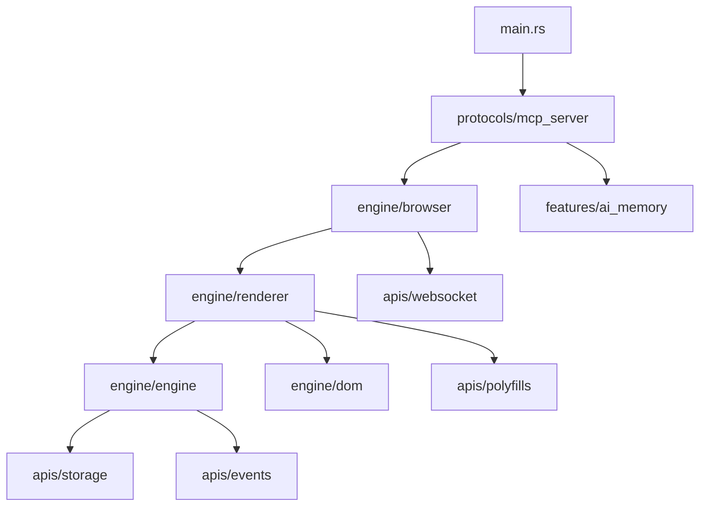

# Synaptic Source Code Architecture

This directory contains the complete implementation of **Synaptic** - a pure Rust headless web browser designed for AI model integration through MCP (Model Context Protocol).

## 🏗️ Architecture Overview

```
src/
├── engine/          # Core browser engine
├── apis/            # Web standards & APIs
├── features/        # Advanced browser capabilities
├── protocols/       # Communication protocols
├── lib.rs           # Public API exports
└── main.rs          # MCP server entry point
```

## 🔧 Core Engine (`src/engine/`)

**The heart of the headless browser - pure Rust implementations**

```rust
// Core browser engine components
pub mod browser;     // HeadlessWebBrowser - main browser interface
pub mod renderer;    // RustRenderer - JavaScript execution & DOM rendering
pub mod engine;      // JavaScriptEngine - Boa-based JS runtime
pub mod dom;         // DOM manipulation & element management
```

### Key Components:
- **`browser.rs`** - Main browser class with HTTP client, cookie management, form handling
- **`renderer.rs`** - JavaScript execution engine with DOM integration and safety sandboxing
- **`engine.rs`** - Advanced JavaScript runtime with timers, promises, and async support
- **`dom.rs`** - DOM tree management, element manipulation, and mutation tracking

## 🌐 Web APIs (`src/apis/`)

**Modern web standards implementation for JavaScript compatibility**

```rust
// Web APIs and standards implementation
pub mod crypto_api;      // Web Crypto API
pub mod fetch_api;       // Fetch API with reqwest backend
pub mod url_api;         // URL and URLSearchParams APIs
pub mod service_worker;  // Service Worker support
pub mod websocket;       // WebSocket connections
pub mod storage;         // localStorage/sessionStorage
pub mod events;          // DOM event system
pub mod polyfills;       // JavaScript polyfills by ES version
```

### Polyfills Structure:
```
polyfills/
├── console.rs           # Enhanced console with multiple log levels
├── timers.rs           # setTimeout/setInterval with real timing
├── web_apis.rs         # Core web API globals
├── syntax_transformer.rs # ES6+ to ES5 transformation
└── es20xx_polyfills.rs # ES2017-2025 feature polyfills
```

## ⚡ Advanced Features (`src/features/`)

**Cutting-edge browser capabilities for AI and modern web**

```rust
// Advanced browser features
pub mod ai_memory;       // AI memory heap for persistent sessions
pub mod react_processor; // React/Next.js SPA processing
pub mod fingerprinting;  // Browser fingerprinting & stealth
pub mod webgl;          // WebGL context simulation
pub mod solver;         // Challenge solver (Cloudflare, etc.)
```

### Feature Highlights:
- **AI Memory** - Persistent storage for research, credentials, bookmarks, notes
- **React Processing** - Server-side rendering reconstruction for SPAs
- **Fingerprinting** - Realistic browser fingerprint generation for stealth
- **Challenge Solving** - Automated solving of web challenges and CAPTCHAs

## 📡 Communication Protocols (`src/protocols/`)

**Integration protocols for AI models and debugging tools**

```rust
// Protocol implementations
pub mod mcp;            // Model Context Protocol for AI integration
pub mod mcp_server;     // MCP server implementation
pub mod cdp;            // Chrome DevTools Protocol compatibility
pub mod cdp_tools;      // CDP utility functions
pub mod memory_tools;   // Memory management tools for MCP
```

### Protocol Support:
- **MCP** - Full JSON-RPC 2.0 implementation for AI model communication
- **CDP** - Chrome DevTools Protocol for debugging and inspection
- **Memory Tools** - Advanced memory management and persistence

## 🚀 Public API (`lib.rs`)

**Clean, organized exports for external use**

```rust
// Re-export main components by category
pub use engine::{HeadlessWebBrowser, RustRenderer, JavaScriptEngine, DomElement, EnhancedDom};
pub use apis::{WebSocketManager, WebStorage, DomEvent};
pub use features::{AiMemoryHeap, ReactProcessor, BrowserFingerprint, ChallengeSolver};
pub use protocols::{McpServer, CdpServer, MemoryTools};
```

## 🎯 Entry Point (`main.rs`)

**MCP server startup with full browser integration**

```rust
// Clean module imports matching directory structure
mod engine;
mod apis;
mod features;
mod protocols;

// Start MCP server with integrated browser
use protocols::mcp_server::McpServer;
```

## 🔒 Security & Safety

### JavaScript Sandboxing
- **Pattern Detection** - Blocks dangerous JS patterns (`eval`, `Function`, etc.)
- **Timeout Protection** - 5-second execution limits
- **Memory Management** - Boa engine handles memory safety
- **API Restrictions** - Controlled access to web APIs

### Network Security
- **TLS/HTTPS Only** - Secure connections by default
- **Cookie Management** - Secure cookie handling with HttpOnly support
- **CSRF Protection** - Token extraction and validation
- **Rate Limiting** - Respectful request patterns

## 🎨 Design Principles

### Pure Rust Philosophy
- **No External Binaries** - No Chrome, Chromium, or Node.js dependencies
- **Memory Safety** - Rust's ownership system prevents common web browser vulnerabilities
- **Performance** - Native speed without V8/Chrome overhead
- **Single Binary** - Easy deployment with all features included

### AI-First Design
- **MCP Integration** - Built specifically for AI model interaction
- **Structured Data** - Clean JSON responses optimized for AI consumption
- **Context Preservation** - Session management for multi-turn AI interactions
- **Memory Persistence** - AI memory heap for long-term learning

### Modern Web Support
- **ES2025 Ready** - Latest JavaScript features through polyfills
- **SPA Support** - React, Vue, Angular application processing
- **WebSocket** - Real-time application support
- **Service Workers** - PWA compatibility

## 📊 Performance Characteristics

| Component | Memory Usage | Speed | Features |
|-----------|-------------|--------|----------|
| Core Engine | ~10MB | 100-500ms/page | HTML, CSS, Basic JS |
| With JS APIs | ~25MB | 500ms-2s/page | Full Web APIs |
| Full Browser | ~40MB | 1-3s/page | React, AI, WebGL |

## 🔧 Development Workflow

### Adding New Features
1. **Choose Directory** - Place in appropriate `engine/`, `apis/`, `features/`, or `protocols/`
2. **Update Module** - Add to respective `mod.rs` file
3. **Export in lib.rs** - Add to public API if needed
4. **Add Tests** - Create matching test in `tests/` directory
5. **Update Documentation** - Document in module and this README

### Testing Strategy
```bash
# Test by component
cargo test engine      # Core browser functionality
cargo test apis        # Web standards compliance
cargo test features    # Advanced capabilities
cargo test protocols   # Communication protocols

# Integration testing
cargo test --test browser_test
cargo test --test mcp_test
```

## 📚 Module Dependencies



## 🎯 Future Enhancements

### Planned Features
- **WebAssembly Support** - Execute WASM modules safely
- **Distributed Scraping** - Multi-node coordination
- **Real-time Updates** - WebSocket and SSE support
- **Plugin System** - External modules for specialized scraping
- **Enhanced Stealth** - Advanced anti-detection capabilities

---

**Synaptic** provides a complete, secure, and AI-optimized headless web browser implementation in pure Rust. The modular architecture ensures maintainability while delivering enterprise-grade performance and security.